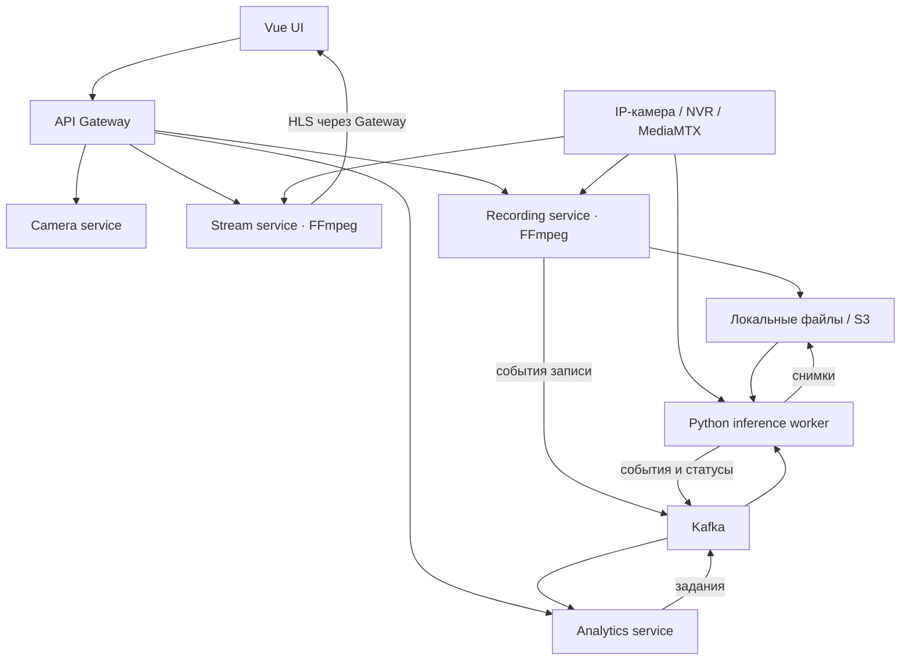

# Smart Surveillance Platform

Учебная и исследовательская платформа видеонаблюдения и видеоаналитики: подключение IP-камер и NVR по RTSP, просмотр в браузере, запись и воспроизведение архива, обнаружение объектов и пересечений линий с помощью YOLO.

Backend построен на Java/Spring Boot и Kafka, интерфейс — на Vue, inference выполняется отдельным Python worker на CPU или GPU. Проект находится в активной разработке; конфигурация демо рассчитана на доверенную тестовую сеть, а не на открытое production-развёртывание.

## Возможности

- **Камеры:** создание и редактирование, категории, избранное, состояния и heartbeat; настройки RTSP, включая формат XM для совместимых NVR. Пароли камер хранятся с шифрованием AES-GCM при настроенном ключе.
- **Прямой эфир:** RTSP → FFmpeg → HLS, просмотр через hls.js, мониторинг потока и повторное подключение. Режимы обработки видео `AUTO`, `COPY`, `TRANSCODE_H264` позволяют учитывать кодек источника и совместимость браузера.
- **Запись и архив:** управление записью отдельно от просмотра, метаданные в PostgreSQL, локальные файлы и экспорт в S3-совместимое хранилище, подготовка HLS для воспроизведения архива.
- **Видеоаналитика:** анализ записи и real-time RTSP, детекция и трекинг объектов, события пересечения настраиваемых линий, направление движения и снимки событий.
- **Управление заданиями:** запуск, остановка, статусы и прогресс; список worker-узлов, heartbeat и сведения об их нагрузке.
- **Профиль анализа:** выбор модели, классов объектов, confidence, устройства и целевой частоты обработки; сохранение профиля по умолчанию в браузере.
- **Результаты:** страницы событий, переход по странице или времени, временная шкала и увеличенный просмотр снимка.
- **Обновления интерфейса:** статусы камер и потоков через WebSocket/STOMP.
- **Поиск:** отдельный сервис индексации и поиска камер в OpenSearch; не входит в основной demo Compose.

## Архитектура

Видеоданные не проходят через Kafka: брокер переносит команды, статусы и события. FFmpeg и inference worker подключаются к источникам видео напрямую.



PostgreSQL хранит данные камер, записей и аналитики. `websocket-service` передаёт события Kafka в UI, а `search-service` обновляет индекс OpenSearch. MediaMTX используется для тестовых RTSP-источников; для подключения реальной камеры он не обязателен.

### Модули и порты

| Модуль | Назначение | Порт по умолчанию |
|---|---|---|
| `frontend` | Vue UI | 5173 |
| `gateway/camera-gateway` | Маршрутизация REST, HLS и WebSocket | 8080 |
| `services/camera-service` | Камеры, настройки подключения, состояния | 8091 |
| `services/search-service` | Индексация и поиск камер | 8093 |
| `services/stream-service` | FFmpeg, live HLS, восстановление потока | 8094 |
| `services/recording-service` | Запись, хранилище, архив и playback | 8095 |
| `services/websocket-service` | WebSocket/STOMP | 8096 |
| `services/analytics-service` | Задания, события, результаты и worker-узлы | 8097 |
| `workers/inference-worker` | YOLO, трекинг и пересечение линий | Без HTTP-сервера |
| `services/notification-service` | Заготовка сервиса уведомлений | — |
| `common/*` | Контракты событий, Kafka и логирование | — |

Порты сервисов в таблице — внутренние порты приложений. Demo Compose публикует не все из них на хост.

### Стек

| Область | Технологии |
|---|---|
| Backend | Java 21, Spring Boot 3.5.8, Spring Cloud Gateway, Spring Data JPA |
| Сборка | Gradle Wrapper, multi-project build |
| Frontend | Vue 3, TypeScript, Vite, Pinia, hls.js, STOMP |
| Видео | RTSP, FFmpeg/ffprobe, HLS, MediaMTX |
| Inference | Python, Ultralytics YOLO, ByteTrack, OpenCV, PyTorch |
| Данные | PostgreSQL, Flyway, S3-совместимое хранилище, OpenSearch |
| Обмен событиями | Apache Kafka в режиме KRaft |
| Наблюдаемость | Spring Boot Actuator/Micrometer, конфигурации Prometheus и Grafana |
| Запуск | Docker Compose; worker можно запускать отдельно, в том числе в WSL |

## Запуск

### 1. Подготовка

Понадобятся Docker с Compose v2 и доступный PostgreSQL. Для локального запуска Java-сервисов нужен JDK 21; для frontend — Node.js, совместимый с Vite 8 (например, 22.12+ в ветке 22), и npm. Для локального worker используется Python 3.12; локальным видеосервисам нужны FFmpeg и ffprobe в `PATH`.

```bash
git clone https://github.com/coltrack-dev/smart-surveillance-platform.git
cd smart-surveillance-platform
cp .env.example .env
```

Заполните `.env` собственными параметрами PostgreSQL и S3. Создайте ключ командой `openssl rand -base64 32` и сохраните его в `CAMERA_CREDENTIALS_KEY`. Не публикуйте `.env`, ключ шифрования и пароли камер. Ключ необходимо сохранять между перезапусками: без прежнего ключа ранее зашифрованные пароли не прочитать.

**Перед первым запуском проверьте конфигурацию:**

- В [docker-compose.demo.yml](docker-compose.demo.yml) PostgreSQL отключён как контейнер, а JDBC URL содержит адрес `192.168.13.128`. Замените адрес в окружении сервисов на адрес своей БД. Одного изменения `POSTGRES_DB` в `.env` для смены хоста недостаточно.
- Настройте внешний адрес Kafka в `KAFKA_ADVERTISED_LISTENERS`. Он должен быть доступен локальным Java-сервисам и удалённому worker; внутри Compose используется `kafka:29092`.
- Подготовьте существующую схему БД или восстановите её из своей тестовой среды. Текущая миграция camera-service изменяет таблицу `cameras`, но не создаёт исходную схему; запуск на совершенно пустой БД пока не автоматизирован. У camera-service и analytics-service включён `ddl-auto: validate`.
- Для аналитики снимков заполните `WASABI_*`: worker и analytics-service должны обращаться к одному хранилищу и префиксу. Названия переменных сохранены для Wasabi, но конфигурация использует S3 endpoint.
- Если нужен только просмотр и локальная запись, отключите `RECORDING_EXPORT_ENABLED` и `RECORDING_S3_ENABLED` в `.env`. Это не отключает требования к S3 у отдельно запускаемого analytics-service.

### 2. Основные сервисы в Docker

Запуск основных сервисов и тестовой камеры без файловых и внешних видеопубликаторов:

```bash
docker compose -f docker-compose.demo.yml up -d --build \
  kafka mediamtx rtsp-test-publisher \
  camera-service stream-service recording-service websocket-service camera-gateway
```

Gateway доступен на `http://localhost:8080`. Для камеры, к которой обращаются контейнеры, используйте RTSP URL `rtsp://mediamtx:8554/test`. С хоста тот же источник доступен как `rtsp://localhost:8554/test`.

Для демо с людьми поместите собственное видео в `data/analytics/input/people.mp4`, затем запустите:

```bash
docker compose -f docker-compose.demo.yml up -d rtsp-file-publisher rtsp-file-publisher-2
```

Они публикуют пути `/people` и `/people-2` на MediaMTX. Полный запуск Compose без списка сервисов также запускает публикатор внешней камеры, доступность которой не гарантируется.

[Обычный docker-compose.yml](docker-compose.yml) — альтернативный набор инфраструктуры для локальной разработки: Kafka, OpenSearch, MediaMTX, тестовый RTSP, Prometheus и Grafana. Не запускайте его одновременно с demo Compose без изменения портов и имён контейнеров.

### 3. Analytics service

По умолчанию demo Gateway направляет аналитику на `http://host.docker.internal:8097`: Java analytics-service запускается отдельно на хосте. Передайте ему `SPRING_DATASOURCE_URL`, `SPRING_DATASOURCE_USERNAME`, `SPRING_DATASOURCE_PASSWORD`, `SPRING_KAFKA_BOOTSTRAP_SERVERS` и `WASABI_*` через окружение процесса.

```bash
./gradlew :services:analytics-service:bootRun
```

Файл `.env` используется Compose для подстановок, но не загружается автоматически этой Gradle-командой.

Альтернатива — профиль `container-analytics` в demo Compose. При его использовании также измените `ANALYTICS_SERVICE_URL` у Gateway на `http://analytics-service:8097`; одного включения профиля недостаточно.

### 4. Frontend

Создайте `frontend/.env.local`:

```dotenv
VITE_API_URL=http://localhost:8080/api/v1
VITE_HLS_URL=http://localhost:8080
VITE_WS_URL=ws://localhost:8080/ws
```

`/api/v1` важен: это префикс маршрутов Gateway. При открытии UI с другой машины замените `localhost` адресом сервера.

```bash
cd frontend
npm ci
npm run dev
```

Откройте `http://localhost:5173`. Frontend запускается отдельно от demo Compose.

### 5. Inference worker

Worker может работать на той же машине или отдельном GPU-узле. Ему нужны доступ к Kafka, RTSP-источникам, HTTP API recording-service и хранилищу снимков. Общая файловая система с Java-сервисами не требуется.

Из корня репозитория:

```bash
python3 -m venv workers/inference-worker/.venv
source workers/inference-worker/.venv/bin/activate
pip install -r workers/inference-worker/requirements.txt
export PYTHONPATH="$PWD/workers/inference-worker/src"
export KAFKA_BOOTSTRAP_SERVERS=localhost:9092
export KAFKA_INPUT_TOPICS=recording.events,analytics.jobs
export RECORDING_SERVICE_URL=http://localhost:8095
export INFERENCE_WORKER_ID=local-worker-01
export YOLO_MODEL=yolo11n.pt
export YOLO_DEVICE=cpu
export KAFKA_ENABLED=true
python -m inference_worker.recording_consumer
```

Перед запуском также экспортируйте `WASABI_*` из своей конфигурации. Файл модели должен быть доступен worker; автоматическая загрузка модели требует доступа к сети. Для NVIDIA GPU требуется совместимая сборка PyTorch с CUDA; затем можно выбрать `cuda:0` в профиле задания. Docker-профиль `inference` сам по себе не настраивает GPU passthrough.

Для удалённого worker замените `localhost` реальными сетевыми адресами. Адрес `mediamtx` из Docker-сети не разрешается на удалённом WSL-узле: в real-time задании укажите источник, доступный именно worker.

Подробности: [README worker](workers/inference-worker/README.md), [пример его окружения](workers/inference-worker/.env.example).

## Как работает аналитика

1. UI передаёт профиль и запрос запуска в analytics-service через Gateway.
2. Сервис сохраняет задание и публикует команду в `analytics.jobs`.
3. Worker получает запись по HTTP либо читает RTSP, выполняет YOLO inference и трекинг, проверяет пересечения линий.
4. Снимки отправляются в хранилище; события, статусы и heartbeat — в Kafka.
5. Analytics-service сохраняет результаты, а UI запрашивает статус и страницы событий через REST.

Профиль по умолчанию хранится в `localStorage` браузера; это не общесистемная настройка для всех пользователей. Параметры передаются при запуске задания. Для изменения уже работающего анализа остановите его и запустите заново.

`targetFps` задаёт целевую частоту анализа, а не FPS исходного видео и не гарантированную производительность. Пропуск кадров и качество изображения влияют на обнаружение небольших или малоконтрастных объектов.

Worker поддерживает режимы `process` и `batched`. В `batched` камеры делят одну модель, а параметры совместимости профилей проверяются при запуске. Подробные ограничения и правила распределения камер между узлами описаны в README worker; отказоустойчивое владение потоками при Kafka rebalance требует дальнейшей проработки.

### Kafka topics

| Topic | Назначение |
|---|---|
| `camera.events` | События камер |
| `camera.heartbeat` | Heartbeat камер |
| `stream-events` | Состояния видеопотоков |
| `recording.events` | События записей, включая готовность к анализу |
| `analytics.jobs` | Команды запуска и остановки анализа |
| `analytics.events` | События видеоаналитики |
| `analytics.job-status` | Статусы и прогресс заданий |
| `analytics.worker-heartbeat` | Состояние inference-узлов |

Для ряда потребителей реализованы retry и DLT. Это не означает автоматическую exactly-once обработку всей системы.

## API через Gateway

Базовый адрес: `http://localhost:8080`.

| Путь | Назначение |
|---|---|
| `/api/v1/cameras` | Камеры |
| `/api/v1/streams/**` | Управление потоками |
| `/api/v1/recordings/**` | Запись, архив, подготовка playback |
| `/api/v1/analytics/realtime/{cameraId}/start` | POST: запуск real-time анализа |
| `/api/v1/analytics/realtime/{cameraId}/stop` | POST: остановка real-time анализа |
| `/api/v1/analytics/recordings/{recordingId}/start` | POST: анализ записи |
| `/api/v1/analytics/recordings/{recordingId}/stop` | POST: остановка анализа записи |
| `/api/v1/analytics/jobs/{jobId}` | GET: состояние задания |
| `/api/v1/analytics/jobs/{jobId}/events` | GET: страницы результатов |
| `/api/v1/analytics/workers` | GET: inference-узлы |
| `/hls/**` | Прямой эфир |
| `/recordings/**` | Ресурсы воспроизведения архива |
| `/ws` | WebSocket/STOMP |

Форматы запросов находятся в [frontend API](frontend/src/api) и контроллерах сервисов. Внутренние пути Java-сервисов отличаются от внешних маршрутов Gateway.

## Сборка и проверки

Из корня репозитория:

```bash
./gradlew build
```

Некоторые Spring context-тесты зависят от доступной инфраструктуры и схемы PostgreSQL: команда не является полностью автономной проверкой на пустой машине.

Frontend:

```bash
cd frontend
npm ci
npm run build
```

Тесты worker из корня, с активированным Python-окружением:

```bash
PYTHONPATH=workers/inference-worker/src python -m unittest discover -s workers/inference-worker/tests
```

## Ограничения и дальнейшее развитие

- Подготовка чистой БД пока требует отдельной работы; миграции camera-service предполагают существующую таблицу камер.
- Demo Compose содержит адреса тестовой сети и не является универсальной конфигурацией запуска без изменений.
- `notification-service` пока является заготовкой: готовая доставка Email, Telegram и Push не заявляется.
- JWT/RBAC, Debezium/CDC, Outbox, Redis и production Kubernetes-развёртывание не следует считать готовыми возможностями текущего проекта.
- Перед внешним размещением нужны аудит доступа к API и внутренним endpoint, TLS, защита Kafka и хранилища, управление секретами, резервное копирование и политика хранения видео.
- Точность детекции и допустимое число камер нужно измерять на целевом оборудовании, модели и реальных видеозаписях.
