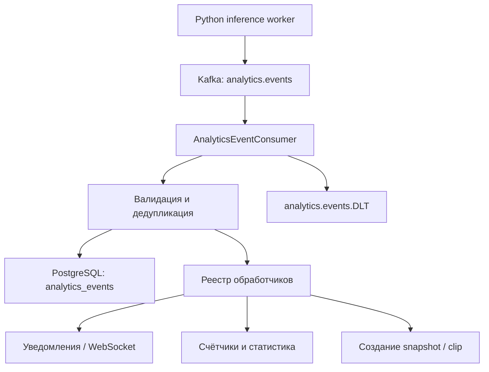

---
### Начальные типы событий

```txt

| Тип                    | Назначение                                        |
| ---------------------- | ------------------------------------------------- |
| `OBJECT_DETECTED`      | Обнаружен человек, автомобиль или другой объект   |
| `LINE_CROSSED`         | Объект пересёк линию                              |
| `ZONE_ENTERED`         | Объект вошёл в зону                               |
| `ZONE_EXITED`          | Объект покинул зону                               |
| `LOITERING_DETECTED`   | Объект слишком долго находится в зоне             |
| `OBJECT_COUNT_CHANGED` | Изменилось количество объектов                    |
| `CAMERA_TAMPERING`     | Камера закрыта, смещена или изображение испорчено |
| `MOTION_DETECTED`      | Обнаружено движение                               |

```

