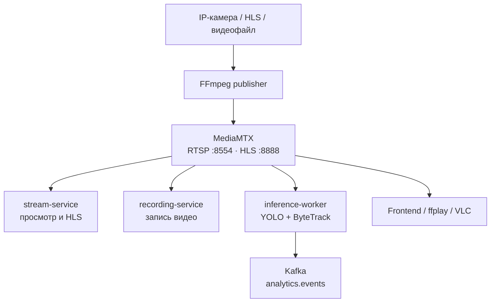
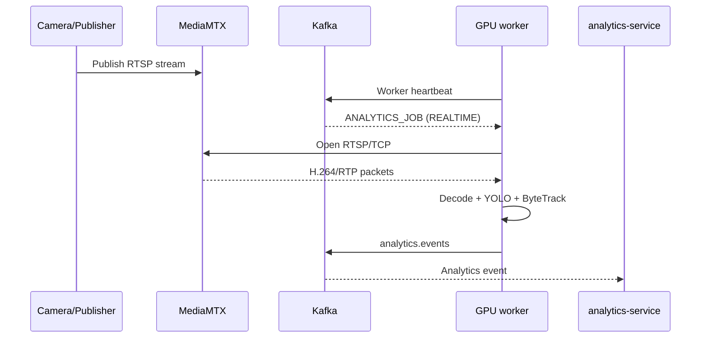

# Архитектура подключения потока камеры

## 1. Назначение документа

Документ описывает подключение видеопотока камеры в проекте `smart-surveillance-platform`: получение исходного потока, его публикацию в MediaMTX и параллельное использование сервисом трансляции, сервисом записи, frontend и inference-worker.

Ключевой принцип: исходная камера или внешний видеосервис подключается к платформе один раз, после чего MediaMTX раздаёт один и тот же поток нескольким независимым потребителям.

## 2. Общая архитектура



MediaMTX является центральным медиамаршрутизатором. Он не выполняет нейросетевой анализ. Его задача — принять опубликованный поток и одновременно передать RTP-пакеты всем подключённым читателям.

## 3. Размещение компонентов

### Основной VMware-хост

Адрес основного хоста в текущем тестовом окружении:

```text
192.168.13.128
```

На нём работают:

- MediaMTX;
- Kafka;
- camera-service;
- stream-service;
- recording-service;
- analytics-service;
- gateway и websocket-service;
- FFmpeg publishers для тестовых источников.

Открытые медиапорты:

| Протокол | Порт | Назначение |
|---|---:|---|
| RTSP | 8554 | Подключение publishers и RTSP-клиентов |
| HLS/HTTP | 8888 | HLS, который формирует MediaMTX |

### Отдельная WSL GPU-нода

На WSL-хосте с NVIDIA GeForce RTX 5080 работает `inference-worker`. Он подключается к MediaMTX по сети и не требует общего Docker network или общего файлового каталога с основными сервисами.

GPU-ноде требуется доступ к:

- `192.168.13.128:8554` — RTSP MediaMTX;
- `192.168.13.128:9092` — внешний listener Kafka;
- `192.168.13.128:8095` — API recording-service для обработки завершённых записей;
- Wasabi/S3 — для загрузки снимков событий.

## 4. Источники MediaMTX

В тестовой конфигурации определены следующие пути:

| Путь | RTSP URL для WSL | Источник |
|---|---|---|
| `test` | `rtsp://192.168.13.128:8554/test` | Генерируемая FFmpeg тестовая таблица |
| `people` | `rtsp://192.168.13.128:8554/people` | Зацикленный файл `people.mp4` |
| `i287` | `rtsp://192.168.13.128:8554/i287` | Внешняя дорожная HLS-камера через FFmpeg |

Для первичного тестирования realtime-инференса рекомендуется `people`, поскольку этот источник воспроизводится циклически и не зависит от доступности внешнего сайта.

## 5. Публикация потока

### RTSP-камера

Если IP-камера уже предоставляет RTSP, MediaMTX может получать поток непосредственно либо через FFmpeg. Использование FFmpeg оправдано, когда необходимы:

- изменение разрешения или FPS;
- преобразование кодека;
- принудительный RTSP/TCP;
- нормализация ключевых кадров;
- восстановление соединения с нестабильным источником.

Типовой адрес публикации:

```text
rtsp://mediamtx:8554/{streamPath}
```

### Внешний HLS-источник

Внешний HLS нельзя передать в MediaMTX как RTSP без промежуточного клиента. FFmpeg читает `.m3u8`, декодирует или копирует видео и публикует результат:

```text
Внешний playlist.m3u8
    → FFmpeg
    → rtsp://mediamtx:8554/i287
```

### Локальный видеофайл

Для имитации живой камеры файл запускается с `-re` и `-stream_loop -1`:

```text
people.mp4
    → FFmpeg в реальном темпе
    → rtsp://mediamtx:8554/people
```

## 6. Параллельные потребители

Один путь MediaMTX допускает несколько одновременных читателей. Например, `rtsp://192.168.13.128:8554/people` могут одновременно открыть:

- stream-service;
- recording-service;
- inference-worker;
- `ffplay`;
- VLC.

Каждый потребитель имеет отдельную клиентскую сессию, но MediaMTX не создаёт новое подключение к исходной камере для каждого из них.

### stream-service

Читает RTSP и предоставляет поток для просмотра согласно логике платформы. Если frontend использует HLS MediaMTX напрямую, адрес имеет вид:

```text
http://192.168.13.128:8888/people/index.m3u8
```

Следует избегать лишнего перекодирования в stream-service, если исходный H.264 уже подходит для HLS.

### recording-service

Получает поток независимо от frontend и inference-worker, сохраняет сегменты или итоговую запись и после завершения публикует `RECORDING_READY`.

### inference-worker

Для realtime-аналитики подключается непосредственно к RTSP MediaMTX:

```text
rtsp://192.168.13.128:8554/people
```

Он декодирует кадры, запускает YOLO и ByteTrack и публикует аналитические события в Kafka. Аннотированное видео не должно возвращаться в основной поток, если оно не требуется пользователю: это сокращает сетевую и вычислительную нагрузку.

## 7. Передача RTSP URL в inference-worker

URL не следует жёстко прописывать в Python-коде. Платформа передаёт его в Kafka-задании `ANALYTICS_JOB`:

```json
{
  "eventType": "ANALYTICS_JOB",
  "schemaVersion": 1,
  "jobId": "bbed268f-e5ef-40f0-a61e-d34a659f24ca",
  "jobType": "REALTIME",
  "cameraId": "29b88ec8-2c36-4879-a7d8-f8e1a4ee4443",
  "source": {
    "type": "RTSP",
    "url": "rtsp://192.168.13.128:8554/people",
    "transport": "tcp"
  },
  "profile": {
    "model": "/models/yolo11n.pt",
    "classes": [0],
    "confidence": 0.5,
    "devicePreference": "cuda:0",
    "targetFps": 10,
    "linePosition": 0.5
  }
}
```

Для текущей топологии в задании используется адрес VMware-хоста, а не Docker DNS-имя `mediamtx`. Имя `mediamtx` разрешается только внутри Docker network основного хоста и недоступно из WSL.

## 8. Последовательность запуска realtime-аналитики



Перед выдачей задания желательно убедиться, что:

1. publisher подключён к MediaMTX;
2. путь доступен;
3. GPU-нода публикует heartbeat;
4. Kafka topic `analytics.jobs` создан;
5. inference-worker имеет свободную ёмкость.

## 9. Проверка доступности

Проверка RTSP из WSL:

```bash
ffprobe \
  -rtsp_transport tcp \
  -v error \
  -show_entries stream=codec_name,width,height,r_frame_rate \
  -of default=noprint_wrappers=1 \
  rtsp://192.168.13.128:8554/people
```

Визуальная проверка:

```bash
ffplay \
  -rtsp_transport tcp \
  rtsp://192.168.13.128:8554/people
```

Проверка HLS:

```bash
curl http://192.168.13.128:8888/people/index.m3u8
```

Проверка открытого порта без FFmpeg:

```bash
nc -vz 192.168.13.128 8554
```

## 10. Производительность

MediaMTX преимущественно маршрутизирует медиапакеты, поэтому его нагрузка значительно ниже нагрузки декодирования и инференса. Основные затраты возникают в следующих местах:

- FFmpeg publisher — декодирование, масштабирование и повторное кодирование;
- stream-service — если выполняет дополнительное перекодирование;
- recording-service — запись на диск или в объектное хранилище;
- inference-worker — декодирование и выполнение YOLO на GPU.

Для realtime-аналитики необязательно анализировать каждый кадр. При входном потоке 15–30 FPS обычно можно задать `targetFps` 5–10 FPS. При пропуске кадров ByteTrack должен получать кадры в последовательном порядке, а очередь необработанных кадров не должна бесконечно расти. Для live-потока предпочтительнее отбросить устаревший кадр и обработать последний доступный.

## 11. Переподключение и ошибки

Realtime-runner должен различать следующие состояния:

| Состояние | Действие |
|---|---|
| RTSP-путь ещё не опубликован | Повторить подключение с задержкой |
| Кратковременный сетевой разрыв | Закрыть decoder и подключиться заново |
| Kafka временно недоступна | Повторять публикацию без остановки чтения, в пределах ограниченного буфера |
| Задание остановлено | Закрыть RTSP и освободить GPU |
| Невосстановимая ошибка конфигурации | Опубликовать статус `FAILED` или `REJECTED` |

Рекомендуется экспоненциальная задержка переподключения с верхним пределом, например 1, 2, 5, 10 и 30 секунд.

## 12. Безопасность

В тестовом окружении RTSP и Kafka используют незашифрованную локальную сеть. Для production необходимо предусмотреть:

- изоляцию MediaMTX и Kafka в VPN/private network;
- RTSP-аутентификацию;
- TLS и SASL для Kafka;
- запрет публикации произвольных MediaMTX paths;
- временные или подписанные URL для записей;
- firewall-правила, разрешающие доступ только доверенным узлам;
- хранение паролей и ключей вне Git.

## 13. Рекомендуемая целевая схема

1. Камера публикует или передаёт поток только в MediaMTX.
2. MediaMTX становится единой точкой раздачи live-видео.
3. Frontend получает HLS без обязательного перекодирования.
4. recording-service читает RTSP и формирует архив.
5. inference-worker на отдельной GPU-ноде читает тот же RTSP.
6. Управление аналитикой выполняется через Kafka jobs, statuses и heartbeat.
7. Результаты аналитики сохраняются analytics-service, а снимки — в Wasabi/S3.

Такая схема отделяет медиатранспорт от бизнес-логики и нейросетевых вычислений, позволяет подключать несколько GPU-нод и не увеличивает количество соединений с исходной камерой при добавлении новых потребителей.
