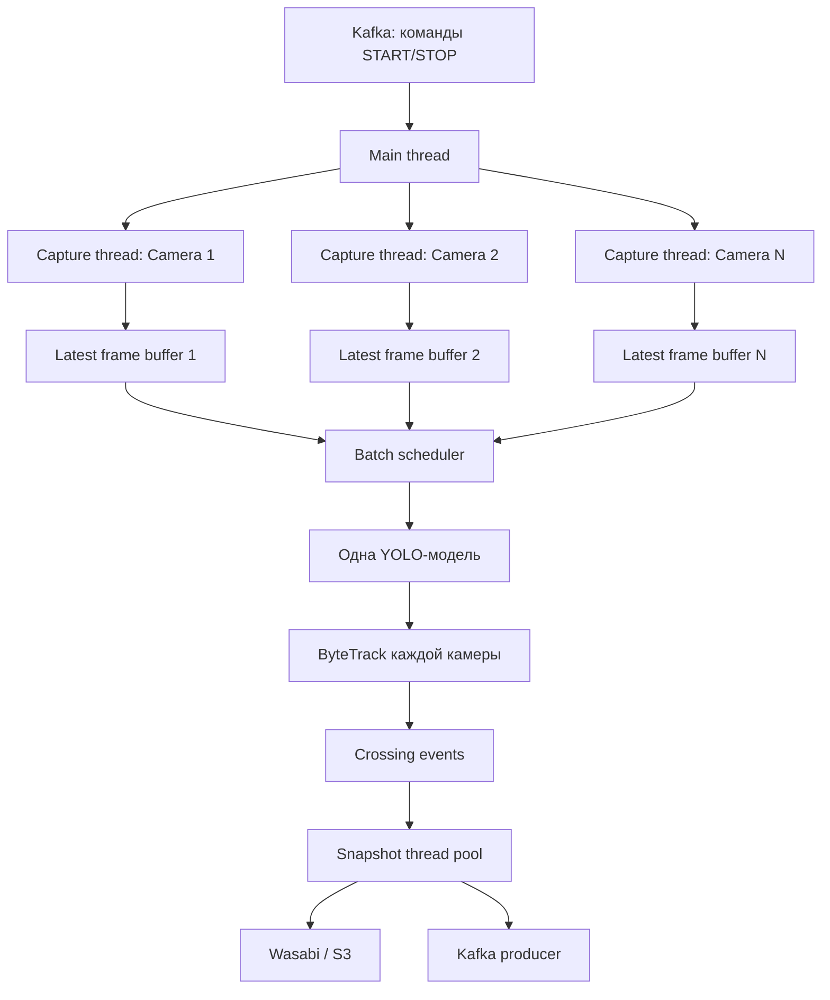
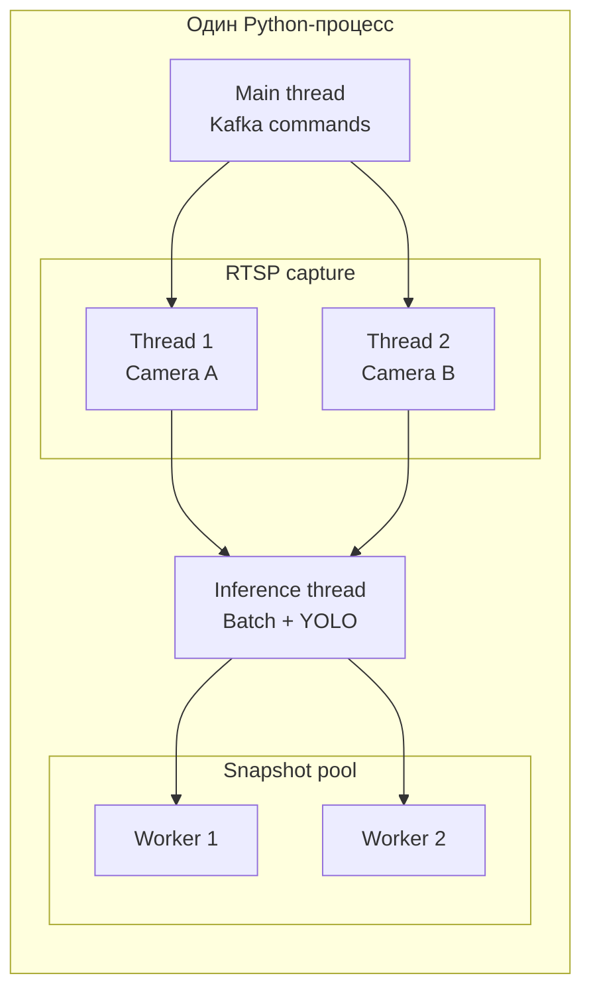
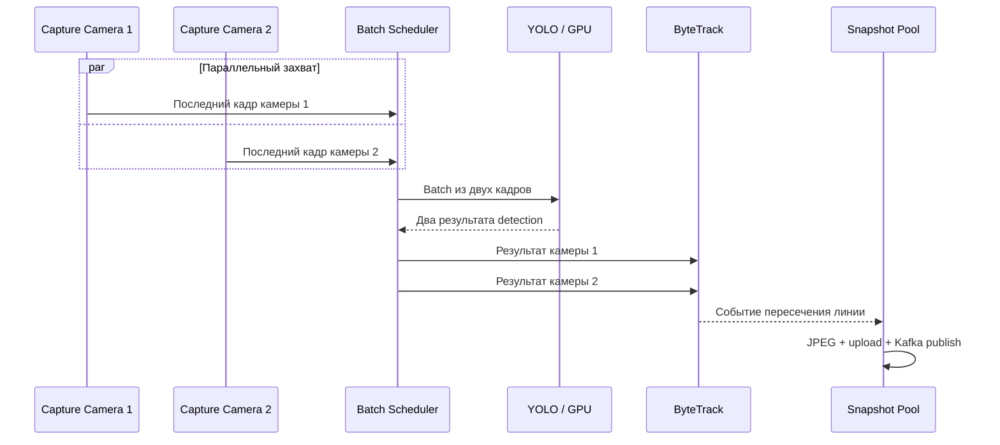
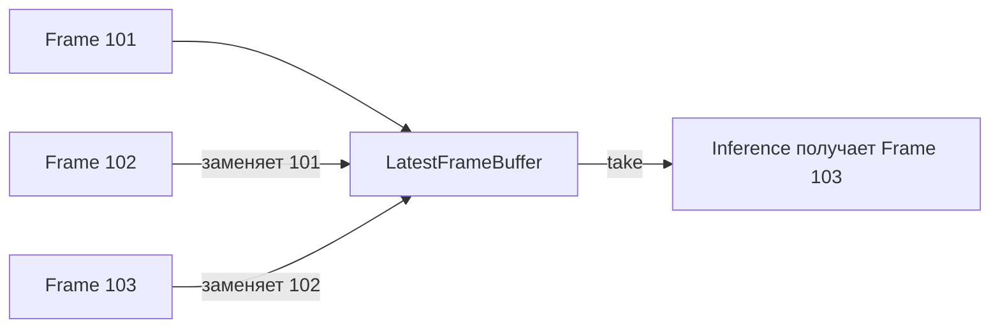
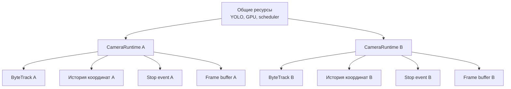
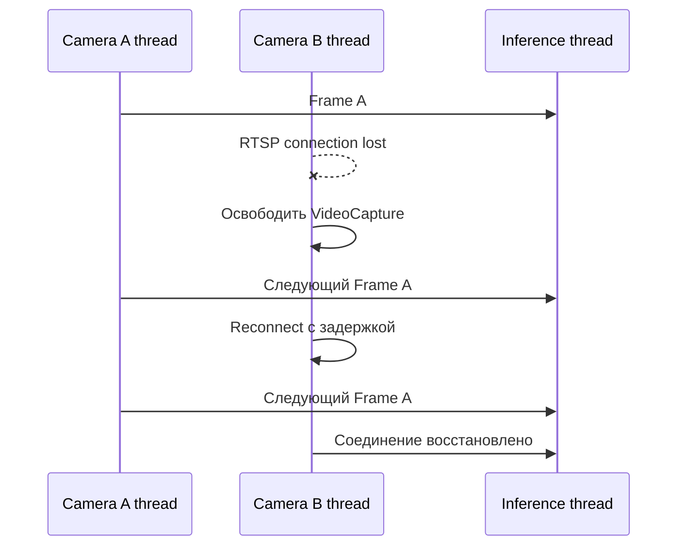

## 1. Архитектура многопоточного worker

Эта схема показывает главное:

* каждой камере соответствует отдельный поток чтения;
* YOLO-модель общая;
* кадры камер собираются в batch;
* состояния ByteTrack разделены;
* сохранение снимков не блокирует inference.
---
## 2.Потоки внутри одного Python-процесса

Здесь полезно подчеркнуть, что это один процесс и одна модель, хотя внутри работает несколько потоков.
---
## 3. Временная диаграмма выполнения

Она показывает разницу между:

* параллельным получением кадров;
* одним пакетным вызовом YOLO;
* последовательным обновлением tracker;
* асинхронной обработкой снимков.
---

## 4. Работа LatestFrameBuffer

Это иллюстрирует, почему worker не накапливает очередь старых кадров. Если камера выдаёт 30 FPS, а аналитика работает с 5 FPS, промежуточные кадры заменяются более свежими.

---

## 5. Состояние отдельных камер

Эта схема особенно важна для объяснения изоляции:

* модель общая;
* tracker, буфер, stop_event и история объектов — отдельные для каждой камеры.

---

## 6. Что происходит при отказе одной камеры

Так наглядно видно: переподключение Camera B не останавливает Camera A и общий inference.
