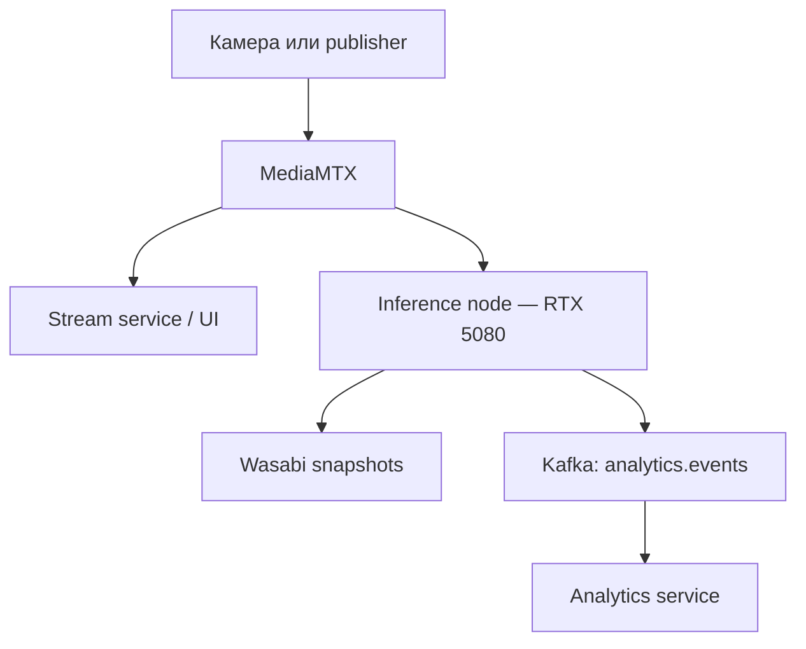
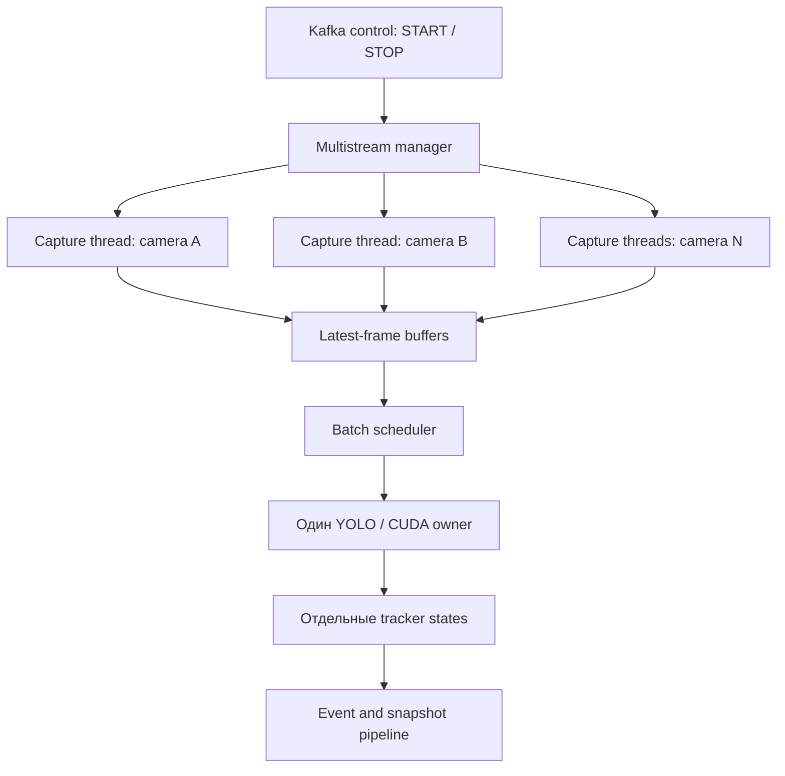

# Предложение по переходу inference-worker на многокамерную модель

## 1. Назначение документа

Документ описывает переход сервиса видеоаналитики от схемы «один процесс на одну камеру» к многокамерному inference с общей моделью YOLO, микробатчингом кадров и независимым трекингом для каждой камеры.

Цели перехода:

- эффективнее использовать NVIDIA GeForce RTX 5080;
- обслуживать несколько RTSP-потоков одним GPU-процессом;
- не загружать отдельную копию модели для каждой камеры;
- уменьшить расход VRAM и накладные расходы запуска процессов;
- сохранить независимые ByteTrack-состояния камер;
- обеспечить управляемые задержки, переподключение RTSP и корректный START/STOP;
- подготовить inference-worker к размещению на отдельной вычислительной ноде.

## 2. Исходные условия

На текущем этапе инфраструктура разделена между двумя хостами:

| Компонент | Размещение | Назначение |
|---|---|---|
| MediaMTX, Kafka и backend-сервисы | основной VMware-хост | приём и раздача потоков, API и обмен событиями |
| inference-worker | отдельный WSL-хост с RTX 5080 | YOLO inference, трекинг и формирование аналитических событий |
| Wasabi/S3 | внешнее объектное хранилище | хранение снимков событий |

Рабочий маршрут данных:



MediaMTX может одновременно отдавать один опубликованный RTSP-поток нескольким клиентам. Поэтому stream-service и inference-worker могут читать один и тот же путь, например `rtsp://192.168.13.128:8554/people`, независимо друг от друга.

## 3. Текущая модель выполнения

`recording_consumer` подписывается на `recording.events` и `analytics.jobs`. Для задания реального времени он запускает отдельный дочерний процесс:

```text
python -m inference_worker.realtime_main
```

Для каждой камеры процесс выполняет полный цикл:

1. загружает собственный экземпляр YOLO;
2. открывает собственное RTSP-соединение;
3. последовательно читает кадры;
4. вызывает `model.track(..., persist=True, tracker="bytetrack.yaml")`;
5. отслеживает пересечение линии;
6. кодирует и загружает снимок;
7. публикует событие в Kafka.

Таким образом, при четырёх активных камерах работают четыре Python-процесса, четыре экземпляра модели и четыре независимых CUDA-контекста.

### Преимущества текущего подхода

- простая изоляция камер;
- падение процесса одной камеры не останавливает остальные;
- ByteTrack автоматически изолирован процессом;
- схема уже проверена от RTSP до `analytics.events`;
- START и STOP реализуются запуском и остановкой процесса.

### Ограничения текущего подхода

- модель многократно размещается в VRAM;
- GPU получает небольшие независимые задания вместо эффективных батчей;
- растёт число CUDA-контекстов и процессов;
- загрузка модели замедляет START;
- управление десятками процессов усложняет диагностику;
- синхронная загрузка снимков может задерживать обработку кадров;
- масштабирование ограничивается памятью раньше, чем вычислительной мощностью GPU.

## 4. Предлагаемая целевая архитектура

Предлагается добавить режим `BATCHED_MULTISTREAM`: один процесс на GPU-ноду, один экземпляр YOLO, отдельный поток захвата для каждой камеры, один владелец CUDA и отдельный трекер для каждой камеры.



Ключевой принцип: многопоточность используется для сетевого I/O и загрузки снимков, а обращения к общей YOLO-модели и CUDA выполняются одним inference-потоком. Это предотвращает гонки внутри модели и даёт GPU батчи кадров сразу от нескольких камер.

## 5. Модель потоков

| Поток или исполнитель | Количество | Ответственность |
|---|---:|---|
| Control/Kafka consumer | 1 | получение START/STOP, регистрация камер, heartbeat |
| RTSP capture | по одному на камеру | чтение потока, выбор кадров по target FPS, переподключение |
| Batch inference | 1 на GPU | формирование батча, вызов YOLO, распределение результатов |
| Snapshot executor | 2–4 | JPEG-кодирование и загрузка снимков в Wasabi |
| Kafka producer callbacks | внутренние потоки клиента | подтверждение публикации событий |

Не следует запускать `model.predict()` или `model.track()` одновременно из нескольких capture-потоков. Один inference-поток должен быть единственным владельцем модели и CUDA-контекста.

## 6. Состояние отдельной камеры

Для каждой активной камеры менеджер хранит объект `CameraRuntime`:

| Поле | Назначение |
|---|---|
| `job_id` | идентификатор задания аналитики |
| `camera_id` | стабильный идентификатор камеры |
| `source_url` | RTSP URL из задания |
| `target_fps` | частота кадров, допускаемых к inference |
| `capture_thread` | поток чтения RTSP |
| `stop_event` | сигнал остановки камеры |
| `latest_frame` | самый новый доступный кадр |
| `frame_sequence` | последовательный номер исходного кадра |
| `captured_at` | время получения кадра |
| `tracker` | отдельный экземпляр ByteTrack |
| `crossing_state` | позиции треков, cooldown и счётчики пересечений |
| `connection_state` | CONNECTING, RUNNING, BACKOFF или STOPPED |
| `metrics` | FPS, пропуски, latency, reconnect count |

Состояние трекера нельзя разделять между камерами: одинаковый `track_id` в разных потоках не означает один и тот же объект.

## 7. Буферизация кадров

Для realtime-аналитики предпочтителен буфер последнего кадра размером 1, а не неограниченная очередь.

Если capture-поток получил новый кадр до обработки предыдущего, старый кадр заменяется. Это осознанный пропуск, позволяющий не накапливать задержку. В противном случае при временном замедлении inference очередь будет расти, а аналитика начнёт показывать события из прошлого.

Рекомендуемая политика:

- `queueSize = 1` для каждой камеры;
- запись нового кадра атомарно заменяет старый;
- число замен учитывается в `frames_dropped_total`;
- batch scheduler получает только кадры, которых ещё не обрабатывал;
- для записей из файлов может использоваться отдельный режим без пропуска кадров.

Псевдокод capture-потока:

```python
while not stop_event.is_set():
    frame = rtsp_reader.read()
    if frame is None:
        reconnect_with_backoff()
        continue

    if not fps_limiter.accept(frame_timestamp):
        continue

    runtime.replace_latest_frame(frame, frame_timestamp)
    scheduler_wakeup.set()
```

## 8. Формирование микробатча

Scheduler циклически просматривает активные камеры и выбирает по одному свежему кадру от каждой. Батч отправляется в YOLO при выполнении одного из условий:

- набран `INFERENCE_BATCH_SIZE`;
- истёк `INFERENCE_BATCH_MAX_WAIT_MS` после появления первого кадра;
- завершается работа процесса.

Рекомендуемая стартовая конфигурация для RTX 5080:

```dotenv
INFERENCE_BATCH_SIZE=4
INFERENCE_BATCH_MAX_WAIT_MS=20
INFERENCE_MAX_CAMERAS=8
ANALYTICS_TARGET_FPS=10
```

Значения являются начальными и должны быть уточнены нагрузочным тестом. Большой batch повышает throughput, но увеличивает ожидание первого кадра. Для realtime важнее ограниченная задержка, поэтому scheduler не должен ждать полного батча бесконечно.

Псевдокод scheduler:

```python
while not shutdown_event.is_set():
    items = collect_fresh_frames_fairly(max_items=batch_size)

    if not items:
        scheduler_wakeup.wait(timeout=idle_wait)
        scheduler_wakeup.clear()
        continue

    items += collect_until_deadline(batch_deadline, batch_size)
    frames = [item.frame for item in items]
    detections = model.predict(frames, device=device, verbose=False)

    for item, result in zip(items, detections):
        tracks = item.runtime.tracker.update(result, item.frame)
        process_crossings(item.runtime, tracks, item.frame)
```

Scheduler должен использовать round-robin или аналогичную справедливую выборку. Камера с высоким входным FPS не должна вытеснять остальные камеры из каждого батча.

## 9. Разделение detection и tracking

Текущий вызов:

```python
model.track(
    frame,
    persist=True,
    tracker="bytetrack.yaml",
    classes=[0],
    conf=CONFIDENCE,
    verbose=False,
)
```

удобен для одного последовательного источника. В многокамерном режиме `persist=True` у общей модели создаёт риск смешивания истории камер, если кадры разных источников проходят через один внутренний tracker.

Целевая схема должна явно разделить два этапа:

1. общая модель выполняет batched detection для массива кадров;
2. результат каждого кадра передаётся в ByteTrack, принадлежащий только соответствующей камере.

Понадобится `TrackerAdapter`, скрывающий конкретный API версии Ultralytics:

```python
class TrackerAdapter:
    def update(self, detections, frame) -> list[Track]:
        """Обновляет tracker одной камеры и возвращает нормализованные треки."""
```

Это также позволит позже заменить ByteTrack на BoT-SORT без изменения batch scheduler и логики пересечения линии.

## 10. Асинхронная обработка снимков и событий

Загрузка JPEG в Wasabi — сетевой I/O, который не должен останавливать inference-поток. При обнаружении события inference-поток формирует неизменяемую задачу и передаёт её в bounded executor.

Состав задачи:

- `event_id`, `job_id`, `camera_id`;
- время события, номер кадра и направление;
- копия кадра или уже вырезанный ROI;
- координаты объекта и линии;
- данные аналитического события.

Рекомендуемый порядок:

1. событие фиксируется с `occurredAt` в момент пересечения;
2. задача попадает в ограниченную очередь snapshot executor;
3. worker кодирует JPEG и загружает его в Wasabi;
4. после успешной загрузки публикует `analytics.events` со ссылкой на snapshot;
5. при ошибке действует ограниченная retry-политика;
6. при переполнении очереди применяется заранее выбранная политика деградации.

Предпочтительная политика переполнения: сохранять событие, но разрешить публикацию без снимка после короткого таймаута. Терять само аналитическое событие из-за медленного объектного хранилища нельзя.

## 11. Управление через Kafka

`analytics.jobs` остаётся control plane для удалённой inference-ноды.

### START

- проверить валидность `cameraId`, `jobId`, `sourceUrl` и профиля;
- сделать операцию идемпотентной;
- если камера уже запущена с тем же заданием, подтвердить текущее состояние;
- если конфигурация изменилась, корректно заменить runtime;
- создать tracker и capture-поток;
- опубликовать статус STARTING, затем RUNNING.

### STOP

- найти runtime по `cameraId` или `jobId`;
- установить `stop_event`;
- закрыть RTSP reader, не ожидая бесконечного сетевого таймаута;
- дождаться завершения capture-потока с timeout;
- удалить tracker и latest frame;
- опубликовать STOPPED;
- повторный STOP считать успешным.

### Kafka key и порядок

Команды и статусы следует публиковать с ключом `cameraId`. Тогда события одной камеры попадут в одну Kafka partition и сохранят порядок START/STOP.

### Heartbeat

Inference-нода должна периодически публиковать:

- `workerId` и GPU name;
- режим выполнения;
- число активных камер и лимит;
- средний и p95 batch size;
- inference latency;
- GPU/VRAM utilization, если метрики доступны;
- dropped frames;
- RTSP reconnects;
- длину очереди snapshot-задач;
- время последнего успешно обработанного кадра по каждой камере.

## 12. Переподключение RTSP

Сбой одной камеры не должен останавливать общий GPU-процесс.

Рекомендуемый алгоритм:

1. перевести камеру в состояние BACKOFF;
2. закрыть текущий reader;
3. повторять соединение с задержками 1, 2, 5, 10 и 30 секунд;
4. ограничить дальнейшую задержку значением 30 секунд;
5. после восстановления перевести камеру в RUNNING;
6. сбросить tracker после длительного разрыва, чтобы старые track ID не связывались с новыми объектами;
7. продолжать heartbeat, указывая ошибку конкретной камеры.

Для H.264 единичные сообщения декодера вроде `error while decoding MB` могут возникать при подключении не с ключевого кадра. Если декодирование быстро восстанавливается, это предупреждение не требует остановки задания.

## 13. Синхронизация и безопасность потоков

Нужны небольшие критические секции, но сетевые операции и inference нельзя выполнять под общим lock.

Рекомендуемые правила:

- отдельный lock защищает реестр активных камер;
- `latest_frame` заменяется под коротким lock конкретной камеры;
- scheduler копирует ссылку на кадр и сразу освобождает lock;
- `tracker` вызывается только inference-потоком;
- capture-поток не изменяет crossing state;
- Wasabi и Kafka callbacks не изменяют tracker;
- STOP сначала ставит флаг, затем освобождает ресурсы вне registry lock;
- shutdown прекращает приём START, останавливает камеры, завершает pending events и закрывает Kafka producer.

## 14. Предлагаемая структура модулей

```text
workers/inference-worker/src/inference_worker/
├── recording_consumer.py       # Kafka control и legacy recording jobs
├── realtime_main.py            # текущий process-per-camera fallback
├── multistream_main.py         # точка запуска общей GPU-модели
├── multistream_manager.py      # START/STOP и реестр камер
├── camera_runtime.py           # состояние одной камеры
├── camera_capture.py           # RTSP read и reconnect
├── batch_scheduler.py          # fairness, deadline и microbatch
├── detector.py                 # единый YOLO model.predict
├── tracker_adapter.py          # отдельный ByteTrack на камеру
├── crossing_processor.py       # общая логика пересечения линии
├── event_pipeline.py           # snapshots, retry и Kafka publish
├── snapshot_storage.py         # существующий Wasabi client
└── metrics.py                  # runtime-метрики и heartbeat
```

Логику пересечения линии следует извлечь из `realtime_main.py`, чтобы legacy- и batched-режимы использовали одну реализацию и формировали одинаковые события.

## 15. Конфигурация

Предлагаемые переменные окружения:

```dotenv
# Выбор реализации
INFERENCE_EXECUTION_MODE=batched

# Ёмкость ноды
INFERENCE_MAX_CAMERAS=8
INFERENCE_BATCH_SIZE=4
INFERENCE_BATCH_MAX_WAIT_MS=20
INFERENCE_CAPTURE_QUEUE_SIZE=1

# Частота обработки
ANALYTICS_TARGET_FPS=10

# Асинхронные snapshots
INFERENCE_SNAPSHOT_WORKERS=2
INFERENCE_SNAPSHOT_QUEUE_SIZE=100
INFERENCE_SNAPSHOT_RETRIES=3

# RTSP
INFERENCE_RTSP_TRANSPORT=tcp
INFERENCE_RTSP_RECONNECT_MAX_SECONDS=30
INFERENCE_TRACKER_RESET_AFTER_SECONDS=5

# GPU
YOLO_DEVICE=cuda:0
YOLO_MODEL=/models/yolo11n.pt
YOLO_CLASSES=0
```

Режим `process` нужно сохранить на период миграции:

```dotenv
INFERENCE_EXECUTION_MODE=process
```

Это обеспечит быстрый rollback без отката кода.

## 16. Этапы реализации

### Этап 0. Зафиксировать baseline

Перед изменениями измерить текущий режим для 1, 2 и 4 камер:

- VRAM;
- CPU и RAM;
- обработанные кадры в секунду;
- p50/p95 end-to-end latency;
- время запуска камеры;
- число пропущенных кадров;
- частоту событий и корректность направлений.

### Этап 1. Выделить общую доменную логику

- вынести crossing state и проверку линии из `realtime_main.py`;
- определить нормализованный тип `Track`;
- оставить поведение существующего realtime-процесса неизменным;
- покрыть новую общую логику unit-тестами.

### Этап 2. Реализовать CameraRuntime и capture

- добавить latest-frame buffer;
- реализовать FPS limiter;
- добавить reconnect/backoff;
- обеспечить быстрое завершение по STOP;
- собрать per-camera метрики.

### Этап 3. Добавить общий detector и scheduler

- загрузить YOLO один раз;
- реализовать microbatch deadline;
- гарантировать fairness;
- распределять результаты по исходным `cameraId`;
- начать с `model.predict`, не используя общий `persist=True`.

### Этап 4. Добавить независимые tracker instances

- создать `TrackerAdapter`;
- один tracker на `CameraRuntime`;
- сбрасывать tracker при STOP и длительном reconnect;
- проверить отсутствие переноса track ID между камерами.

### Этап 5. Вынести snapshots из inference-потока

- добавить bounded executor;
- определить retry и overflow policy;
- сохранить точное `occurredAt` независимо от времени загрузки;
- добавить метрики очереди и ошибок Wasabi.

### Этап 6. Интегрировать Kafka lifecycle

- реализовать идемпотентные START/STOP;
- расширить heartbeat;
- публиковать состояния STARTING, RUNNING, DEGRADED, STOPPED и FAILED;
- обеспечить корректное завершение при SIGTERM.

### Этап 7. Canary и переключение

- оставить `process` значением по умолчанию на первой сборке;
- включить `batched` на тестовой GPU-ноде;
- проверить 1 камеру, затем 2, 4 и 8;
- сравнить события с legacy-режимом;
- после успешной проверки сделать `batched` основным режимом;
- сохранить legacy fallback минимум на один релизный цикл.

## 17. Тестирование

### Unit-тесты

- новый кадр заменяет старый в latest-frame buffer;
- один frame sequence не обрабатывается дважды;
- scheduler не допускает starvation;
- deadline выпускает неполный батч;
- START и STOP идемпотентны;
- tracker A никогда не получает detections камеры B;
- reconnect сбрасывает tracker после заданного интервала;
- crossing state корректно обрабатывает направления и cooldown;
- переполнение snapshot queue следует выбранной политике.

### Интеграционные тесты

- две зацикленные записи публикуются в разные MediaMTX paths;
- обе камеры одновременно запускаются через `analytics.jobs`;
- события содержат правильные `cameraId` и `jobId`;
- STOP одной камеры не влияет на вторую;
- повторный START восстанавливает только нужную камеру;
- временное отключение RTSP приводит к reconnect;
- недоступный Wasabi не останавливает inference;
- временная недоступность Kafka обрабатывается согласно producer policy.

### Нагрузочный тест

Сравнить два режима на одинаковых потоках и профиле:

| Режим | Камеры | Target FPS | Batch | VRAM | p95 latency | Dropped frames | GPU util |
|---|---:|---:|---:|---:|---:|---:|---:|
| process | 1 | 10 | 1 | измерить | измерить | измерить | измерить |
| process | 2 | 10 | 1 | измерить | измерить | измерить | измерить |
| process | 4 | 10 | 1 | измерить | измерить | измерить | измерить |
| batched | 1 | 10 | до 4 | измерить | измерить | измерить | измерить |
| batched | 2 | 10 | до 4 | измерить | измерить | измерить | измерить |
| batched | 4 | 10 | до 4 | измерить | измерить | измерить | измерить |
| batched | 8 | 10 | до 4/8 | измерить | измерить | измерить | измерить |

Количество поддерживаемых камер нельзя определять только по загрузке GPU. Нужно учитывать декодирование, разрешение, target FPS, сложность сцены, tracking, JPEG и скорость сети.

## 18. Метрики и наблюдаемость

Минимальный набор метрик:

| Метрика | Уровень | Смысл |
|---|---|---|
| `active_cameras` | worker | число активных runtime |
| `batch_size` | worker | фактический размер батча |
| `batch_wait_ms` | worker | ожидание формирования батча |
| `inference_duration_ms` | worker | время YOLO для батча |
| `end_to_end_latency_ms` | camera | от capture до события |
| `frames_captured_total` | camera | прочитанные кадры |
| `frames_inferred_total` | camera | обработанные YOLO кадры |
| `frames_dropped_total` | camera | заменённые latest frames |
| `rtsp_reconnects_total` | camera | число переподключений |
| `last_frame_age_seconds` | camera | свежесть потока |
| `active_tracks` | camera | число активных треков |
| `snapshot_queue_size` | worker | backlog снимков |
| `snapshot_failures_total` | worker | ошибки Wasabi |
| `events_published_total` | camera | успешные Kafka events |

Логи должны включать `workerId`, `cameraId`, `jobId`, `batchSize`, `frameSequence` и `eventId`, чтобы путь конкретного события можно было восстановить между нодами.

## 19. Риски и меры снижения

| Риск | Последствие | Мера |
|---|---|---|
| Общий tracker для разных камер | смешанные track ID и ложные пересечения | отдельный tracker на CameraRuntime |
| Параллельный вызов общей YOLO-модели | гонки и нестабильность CUDA | один inference thread |
| Неограниченные frame queues | постоянно растущая задержка и RAM | latest-frame buffer размером 1 |
| Большой batch wait | ухудшение realtime latency | deadline 10–30 мс |
| Медленная камера | starvation или задержка батча | scheduler не ждёт конкретную камеру |
| Недоступный Wasabi | блокировка GPU loop | bounded async event pipeline |
| GPU OOM | остановка всех камер ноды | лимит камер, batch cap и мониторинг VRAM |
| Падение общего процесса | затрагивает все камеры ноды | supervisor, readiness и legacy fallback |
| RTSP reconnect | ложное продолжение старых tracks | сброс tracker после разрыва |
| Kafka rebalance | повтор START/STOP | идемпотентные команды и состояние по jobId |
| Версионная зависимость от Ultralytics tracker API | поломка после обновления | собственный TrackerAdapter и pin версии |

## 20. Дальнейшая оптимизация декодирования

Первая версия может оставить OpenCV/FFmpeg-декодирование в capture-потоках. Это минимизирует объём изменений и позволяет сначала доказать пользу общего YOLO batching.

Если при большом числе камер CPU станет узким местом, следующий отдельный этап:

- перейти на PyAV/FFmpeg с более управляемыми таймаутами;
- проверить аппаратное H.264/H.265-декодирование через NVDEC;
- использовать NVIDIA DeepStream, если число камер станет значительно больше и потребуется полностью GPU-ориентированный pipeline;
- по возможности получать от MediaMTX дополнительный низкобитрейтный/substream-поток для аналитики.

DeepStream не следует вводить одновременно с первой миграцией: он существенно меняет pipeline и усложняет диагностику. Сначала рекомендуется внедрить shared model, per-camera trackers и microbatching в существующем Python worker.

## 21. Критерии приёмки

Переход можно считать успешным, если:

- YOLO загружается в GPU-процессе один раз;
- одновременно работают минимум 4 тестовые камеры;
- каждая камера имеет независимые track ID и crossing state;
- STOP одной камеры не останавливает остальные;
- STOP отражается в runtime не позднее 5 секунд;
- RTSP автоматически восстанавливается после кратковременного разрыва;
- память не растёт из-за очередей кадров или снимков;
- события сохраняют существующий Kafka-контракт;
- снимки продолжают загружаться в Wasabi;
- p95 end-to-end latency остаётся в согласованном realtime-бюджете;
- при одной камере нет функциональной регрессии относительно legacy-режима;
- переключение обратно на `INFERENCE_EXECUTION_MODE=process` не требует изменения кода.

Рекомендуемый первоначальный бюджет p95 latency — не более 1 секунды при `targetFps=10`, но окончательное значение нужно утвердить после baseline-измерений и с учётом требований продукта.

## 22. Итоговая рекомендация

Наиболее практичный следующий шаг — не создавать несколько потоков, которые одновременно вызывают один `model.track()`, а перейти к архитектуре:

1. один GPU-процесс на inference-ноду;
2. один capture-поток на RTSP-камеру;
3. latest-frame buffer размером 1;
4. один batch scheduler и один владелец YOLO/CUDA;
5. batched detection для кадров разных камер;
6. отдельный ByteTrack и crossing state для каждой камеры;
7. отдельный bounded executor для Wasabi и публикации событий;
8. Kafka START/STOP и heartbeat как распределённый control plane;
9. feature flag для безопасного переключения между legacy и batched режимами.

Такая схема даст основной выигрыш от RTX 5080, сохранит корректность трекинга и позволит в дальнейшем добавлять GPU-ноды без изменения MediaMTX, camera-service, stream-service и пользовательского интерфейса.
