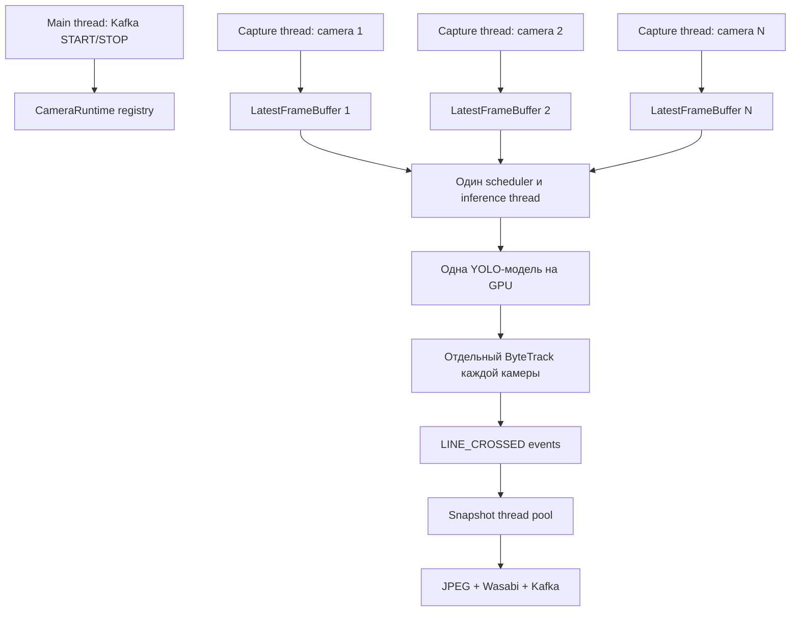

# Многопоточность в многокамерном `inference-worker`

## 1. Назначение документа

Этот документ объясняет устройство многокамерного `inference-worker`, роль потоков Python, влияние GIL, работу буферов кадров, пакетного YOLO inference, ByteTrack, CUDA и фоновой загрузки снимков.

Главная идея реализации:

> Захват RTSP выполняется параллельно для каждой камеры, но обращения к общей YOLO-модели централизованы в одном inference-потоке. Кадры разных камер объединяются в batch.

Это не схема «несколько Python-потоков одновременно вызывают YOLO». Это конвейер, в котором сетевой ввод, GPU inference и загрузка снимков выполняются независимо.

## 2. Общая архитектура



При двух камерах процесс обычно содержит:

| Поток | Ответственность |
|---|---|
| Main thread | Чтение `analytics.jobs`, обработка START и STOP |
| Capture camera 1 | Чтение первого RTSP-потока |
| Capture camera 2 | Чтение второго RTSP-потока |
| Inference thread | Формирование batch и запуск общей YOLO-модели |
| Snapshot workers | JPEG-кодирование, Wasabi и публикация события |
| Внутренние потоки Kafka | Сетевое обслуживание producer и consumer |

Добавление камеры создаёт новый capture thread и отдельный tracker, но не загружает новую копию YOLO.

## 3. Почему каждой камере нужен отдельный capture thread

Чтение RTSP является потенциально блокирующей операцией:

```python
success, frame = capture.read()
```

Камера может медленно отдавать данные, потерять сеть, зависнуть или находиться в процессе переподключения. При последовательном чтении камер одним потоком проблема первой камеры задерживала бы остальные:

```python
frame_a = camera_a.read()
frame_b = camera_b.read()
```

Отдельные потоки изолируют источники:

```text
Camera A → capture thread A
Camera B → capture thread B
```

Лог реального запуска уже подтвердил такую изоляцию: вторая камера получала `Connection refused`, а первая продолжала обнаруживать пересечения, загружать снимки и публиковать события.

## 4. GIL в CPython

CPython использует Global Interpreter Lock (GIL). В каждый момент времени только один поток выполняет обычный Python bytecode внутри одного процесса.

Поэтому два потока с чистыми CPU-вычислениями обычно не ускорят такой код:

```python
for value in range(100_000_000):
    total += value
```

Но GIL не делает Python threads бесполезными. Большая часть тяжёлой работы нашего worker выполняется нативными библиотеками или связана с ожиданием ввода-вывода:

- OpenCV и FFmpeg читают и декодируют RTSP;
- PyTorch выполняет вычисления в C++ и CUDA;
- `librdkafka` обслуживает Kafka;
- клиент S3 ожидает сетевые ответы;
- OpenCV кодирует JPEG в нативном коде.

Во время многих таких операций GIL освобождается. Поэтому capture threads могут ждать разные камеры, пока основной поток принимает Kafka-команды, а snapshot workers загружают файлы.

Практический вывод:

- threads подходят для RTSP, Kafka, S3 и других I/O-задач;
- тяжёлые вычисления на чистом Python лучше переносить в процессы, нативные библиотеки или на GPU;
- GIL почти не мешает выбранной архитектуре, потому что YOLO выполняется PyTorch/CUDA, а ввод-вывод производится нативными библиотеками.

## 5. `CameraRuntime`

Для каждой активной камеры хранится отдельное runtime-состояние. Концептуально оно выглядит так:

```python
@dataclass
class CameraRuntime:
    job: AnalyticsJob
    target_fps: float
    line_position: float
    buffer: LatestFrameBuffer
    stop_event: threading.Event
    capture_thread: threading.Thread | None
    tracker: BYTETracker
    previous_y_by_track: dict[int, int]
    last_crossing_at_by_track: dict[int, float]
```

Изолированное состояние необходимо, чтобы:

- track ID разных камер не смешивались;
- положение объекта на предыдущем кадре относилось к правильной камере;
- cooldown пересечения рассчитывался отдельно;
- потеря одного RTSP-соединения не затрагивала другие камеры.

Общими остаются YOLO-модель, GPU, Kafka producer и пул snapshot workers.

## 6. `LatestFrameBuffer`

Для каждой камеры используется буфер последнего кадра с логической ёмкостью один.

Пусть RTSP выдаёт 25 FPS, а аналитика обрабатывает 5 FPS. Если сохранять каждый кадр, очередь будет постоянно расти, а inference начнёт анализировать устаревшее видео.

Вместо накопления очереди новый кадр заменяет старый:

```text
frame 101 опубликован
frame 102 заменяет frame 101
frame 103 заменяет frame 102
inference получает frame 103
```

Некоторые кадры сознательно отбрасываются. Для realtime-аналитики это обычно правильнее, чем обработка каждого кадра с растущей задержкой.

### 6.1. Синхронизация буфера

Capture thread записывает кадр, а inference thread забирает его. Без блокировки возможна race condition:

1. inference проверяет наличие кадра;
2. capture публикует новый кадр;
3. inference очищает буфер;
4. новый кадр теряется.

Поэтому чтение и изменение ссылки на кадр выполняются атомарно под `threading.Lock`:

```python
with self._lock:
    envelope = self._latest
    self._latest = None
    return envelope
```

Lock должен удерживаться минимальное время. Нельзя выполнять под ним YOLO, RTSP-чтение, JPEG-кодирование или S3 upload — иначе один медленный вызов заблокирует другие потоки.

### 6.2. Передача массива изображения

Кадр обычно представляет собой `numpy.ndarray`. Для эффективности между потоками передаётся ссылка, а не полная копия изображения.

Это безопасно при условии, что capture thread после публикации больше не изменяет данный массив. Если одна и та же память переиспользуется и модифицируется, inference может увидеть частично изменённый кадр. В текущей схеме OpenCV возвращает новый кадр на каждом успешном `read()`.

## 7. Общий scheduler и microbatching

Inference thread собирает последние доступные кадры разных камер:

```python
frames = [
    camera_a.buffer.take(),
    camera_b.buffer.take(),
]

results = model.predict(frames)
```

Соответствие камеры и результата определяется позицией:

```text
batch[0] → camera A → result[0]
batch[1] → camera B → result[1]
```

Поэтому списки runtime и кадров должны формироваться и обрабатываться совместно:

```python
for runtime, result in zip(runtimes, results):
    process_result(runtime, result)
```

Нельзя независимо сортировать список результатов или камер: иначе детекции одной сцены попадут в tracker другой.

### 7.1. Размер batch и timeout

Scheduler запускает inference при выполнении одного из условий:

1. набрано `INFERENCE_BATCH_SIZE` кадров;
2. истёк `INFERENCE_BATCH_MAX_WAIT_MS`.

Пример:

```text
INFERENCE_BATCH_SIZE=4
INFERENCE_BATCH_MAX_WAIT_MS=20
```

Если доступны четыре камеры, batch отправляется сразу. Если работает одна камера, по истечении 20 мс запускается batch размером один.

Компромисс:

- большой timeout повышает вероятность полного batch, но увеличивает latency;
- маленький timeout снижает latency, но чаще отправляет неполные batches;
- слишком большой batch может увеличить время ожидания и потребление VRAM.

### 7.2. Round-robin и starvation

Если scheduler всегда начинает обход с первой камеры, источник с высокой частотой кадров может чаще попадать в batch. Для равномерности применяется round-robin:

```text
цикл 1: A → B → C → D
цикл 2: B → C → D → A
цикл 3: C → D → A → B
```

Так камера, расположенная в конце registry, не остаётся без обработки.

## 8. Почему YOLO вызывается из одного потока

Можно было бы попробовать вызывать одну модель одновременно из нескольких потоков:

```text
thread A → model.predict(frame A)
thread B → model.predict(frame B)
```

Но это приводит к конкуренции за CUDA device и усложняет корректность:

- thread safety внутренних структур модели может отличаться между версиями;
- сложнее контролировать порядок и потребление VRAM;
- появляются дополнительные точки CUDA synchronization;
- динамический batching становится почти невозможным;
- ошибки становятся редкими и трудно воспроизводимыми.

Поэтому используется правило единственного владельца:

```text
один процесс → одна YOLO → один inference thread → один GPU
```

Параллелизм достигается не одновременными вызовами модели, а обработкой нескольких кадров в одном batch.

## 9. Почему batch эффективнее нескольких процессов с моделями

Старая схема:

```text
Camera A → process A → YOLO copy A → CUDA context A
Camera B → process B → YOLO copy B → CUDA context B
```

Новая схема:

```text
Camera A ─┐
Camera B ─┼→ batch → shared YOLO → один CUDA context
Camera C ─┘
```

Преимущества:

- веса YOLO находятся в VRAM один раз;
- используется один CUDA-контекст;
- уменьшается время запуска новой камеры;
- GPU получает более крупную задачу;
- проще ограничивать нагрузку и количество камер;
- уменьшается конкуренция нескольких процессов за GPU.

Batch из четырёх кадров обычно выполняется дольше, чем один кадр, но потенциально быстрее четырёх независимых вызовов. Точный эффект зависит от модели, разрешения, версии PyTorch и GPU и должен измеряться.

## 10. Ограничение `targetFps`

Камера может отдавать 25–30 FPS, но аналитике пересечения линии часто достаточно 5–10 FPS.

```text
targetFps=5 → целевой интервал около 200 мс
targetFps=10 → целевой интервал около 100 мс
```

Capture thread продолжает получать свежие кадры, а scheduler реже выбирает камеру для inference. Это снижает GPU-нагрузку без накопления очереди.

Слишком низкий FPS может пропустить быстрое пересечение узкой зоны. Поэтому параметр нужно подбирать с учётом скорости объектов и положения линии.

## 11. Отдельный ByteTrack для каждой камеры

YOLO обнаруживает объекты на текущем кадре, но не обеспечивает стабильный ID между кадрами. ByteTrack сопоставляет детекции во времени.

Один общий tracker для всех камер использовать нельзя: координаты и траектории объектов из независимых сцен начнут смешиваться.

Поэтому каждая камера имеет:

```python
runtime.tracker
runtime.previous_y_by_track
runtime.last_crossing_at_by_track
```

Tracking выполняется последовательно после общего YOLO batch:

```text
result A → tracker A
result B → tracker B
```

ByteTrack является stateful-компонентом. Кадры одной камеры должны попадать в него строго по времени. Если позже tracking будет вынесен в отдельный pool, потребуется обеспечить последовательную очередь для каждой камеры.

### 11.1. Совместимость версий Ultralytics

Сигнатура конструктора `BYTETracker` менялась между версиями Ultralytics. В одной версии поддерживается:

```python
BYTETracker(args=config, frame_rate=10)
```

В установленной на GPU-ноде версии принимается только:

```python
BYTETracker(args=config)
```

Поэтому worker использует совместимый fallback при ошибке неизвестного аргумента `frame_rate`. Это пример того, почему интеграции с внутренними API библиотек необходимо покрывать smoke-тестом в фактическом окружении.

## 12. Асинхронная обработка snapshots

При пересечении линии необходимо:

1. закодировать кадр в JPEG;
2. загрузить снимок в Wasabi;
3. опубликовать событие Kafka.

Если выполнить это непосредственно в inference thread, медленный S3-запрос остановит аналитику всех камер. Поэтому используется `ThreadPoolExecutor`:

```python
snapshot_executor.submit(upload_and_publish, event, frame)
```

Inference thread передаёт задачу и продолжает формировать следующий batch.

### 12.1. Риск неограниченной очереди

Стандартный `ThreadPoolExecutor` использует внутреннюю очередь без жёсткого ограничения. При большом количестве событий и недоступном Wasabi задания могут накапливаться в памяти.

Для production-версии следует добавить:

- bounded queue;
- метрику длины очереди;
- timeout загрузки;
- ограниченное число retry;
- счётчик отброшенных snapshots;
- публикацию события без снимка при отказе storage;
- circuit breaker для длительной недоступности Wasabi.

## 13. START и общий registry камер

При получении `REALTIME START` основной Kafka thread:

1. разбирает `AnalyticsJob`;
2. проверяет RTSP URL и профиль;
3. создаёт `CameraRuntime`;
4. создаёт ByteTrack;
5. запускает capture thread;
6. добавляет камеру в registry;
7. при необходимости запускает общий inference thread.

Registry разделяется между main thread и inference thread, поэтому доступ к нему синхронизируется. Правильный шаблон — получить snapshot списка под lock и сразу отпустить блокировку:

```python
with cameras_lock:
    runtimes = list(cameras.values())

# Дальнейшая работа выполняется без cameras_lock.
```

Нельзя удерживать общий lock во время `model.predict()`, иначе START и STOP будут ждать завершения GPU inference.

## 14. STOP и корректное завершение

При `REALTIME STOP`:

1. камера удаляется из scheduler registry;
2. вызывается `runtime.stop_event.set()`;
3. capture loop замечает сигнал;
4. `VideoCapture` освобождается;
5. выполняется `capture_thread.join(timeout=...)`;
6. buffer и tracker становятся доступными сборщику мусора.

Для межпоточного сигнала используется `threading.Event`, а не обычный boolean:

```python
while not runtime.stop_event.is_set():
    ...
```

`capture.read()` может блокироваться до сетевого timeout, поэтому STOP не всегда завершается мгновенно. Ограниченный timeout OpenCV/FFmpeg не позволяет thread зависнуть навсегда.

## 15. Переподключение RTSP

Каждая камера имеет независимый reconnect loop:

```text
read failed
→ release VideoCapture
→ wait
→ create new VideoCapture
→ reconnect
```

Рекомендуется exponential backoff:

```text
1 с → 2 с → 4 с → 8 с → 16 с → максимум 30 с
```

Это снижает CPU-нагрузку и объём журналов при длительно недоступной камере.

После долгого разрыва tracker желательно сбросить. Иначе старые траектории могут ошибочно сопоставиться с объектами после восстановления потока.

## 16. CUDA и асинхронность

CUDA-вызовы часто асинхронны: CPU ставит операции в очередь GPU и продолжает выполнение. Некоторые операции вызывают неявную синхронизацию:

- перенос tensor на CPU;
- `.cpu()`;
- преобразование в NumPy;
- чтение отдельных значений;
- некоторые операции постобработки.

Обычный замер времени может не отражать фактическое завершение GPU-работы:

```python
start = time.perf_counter()
result = model.predict(frames)
elapsed = time.perf_counter() - start
```

Для точного benchmark можно синхронизировать CUDA:

```python
torch.cuda.synchronize()
start = time.perf_counter()

result = model.predict(frames)

torch.cuda.synchronize()
elapsed = time.perf_counter() - start
```

Такую синхронизацию лучше включать только в benchmark-режиме: постоянный `torch.cuda.synchronize()` уменьшает возможности перекрытия CPU- и GPU-работы.

## 17. Threads, processes и async

| Механизм | Где подходит в нашем проекте | Ограничения |
|---|---|---|
| `threading.Thread` | RTSP, I/O, coordination | GIL ограничивает чистый Python CPU-код |
| `ThreadPoolExecutor` | Wasabi, JPEG, фоновые операции | Нужна ограниченная очередь |
| `multiprocessing` | Несколько независимых GPU или тяжёлый Python CPU-код | Копии памяти и сложный lifecycle |
| `asyncio` | Большое число async-native сетевых клиентов | OpenCV `VideoCapture` не является async-native |
| CUDA batching | Основное ускорение YOLO | Требует общей модели и контроля VRAM |

В текущей задаче `asyncio` не заменяет capture threads, поскольку OpenCV предоставляет блокирующий API. Оборачивание `capture.read()` через executor фактически снова использовало бы threads.

Несколько процессов оправданы при нескольких GPU или необходимости строгой изоляции нод. Для одной RTX 5080 один процесс с общей моделью обычно эффективнее процесса на камеру.

## 18. Где возможны race conditions

Основные зоны риска:

1. Одновременное добавление/удаление камеры и обход registry.
2. Публикация и получение кадра из `LatestFrameBuffer`.
3. STOP во время обработки результата текущего batch.
4. Изменение tracker из нескольких потоков.
5. Публикация события после остановки камеры.
6. Завершение процесса при незаконченных snapshot uploads.

Базовые правила:

- один tracker изменяется только inference thread;
- YOLO вызывается только inference thread;
- общий registry защищён lock;
- buffer выполняет короткие атомарные операции;
- STOP использует `Event`;
- I/O не выполняется под общими locks;
- executor корректно закрывается при завершении процесса.

## 19. Что проверяют многопоточные тесты

Добавленные тесты проверяют:

- два consumer-потока одновременно пытаются получить один кадр — его получает только один;
- быстрый producer и медленный consumer не создают растущую очередь;
- consumer получает свежий, а не самый старый кадр;
- параллельная публикация кадров разных камер не смешивает состояния;
- тесты многократно проходят без зависаний.

Однако unit-тесты не заменяют интеграционный тест с реальными RTSP, CUDA, Kafka и Wasabi. Особенно важны ошибки, зависящие от версий OpenCV, Ultralytics, PyTorch и драйвера NVIDIA.

## 20. Метрики для проверки архитектуры

Следует измерять:

- фактический FPS каждой камеры;
- общий inference FPS;
- размер фактического batch;
- p50/p95 возраста кадра при начале inference;
- количество заменённых кадров;
- GPU utilization;
- VRAM;
- CPU процесса и capture threads;
- число reconnect;
- длительность `model.predict()`;
- длительность postprocessing и ByteTrack;
- длину snapshot queue;
- время JPEG encoding и Wasabi upload;
- число ошибок Kafka и storage.

Особенно важен возраст кадра:

```text
frame_age = inference_started_at - frame_captured_at
```

Высокий FPS сам по себе не гарантирует realtime-работу, если обрабатываются старые кадры.

## 21. Практическая модель выполнения двух камер

Для потоков `/people` и `/people-2` происходит следующее:

1. Capture thread A читает `/people`.
2. Capture thread B независимо читает `/people-2`.
3. Каждый сохраняет только последний кадр в собственный buffer.
4. Scheduler выбирает свежие кадры обеих камер.
5. Одна YOLO получает batch из двух изображений.
6. `result[0]` передаётся tracker A, `result[1]` — tracker B.
7. При пересечении создаётся snapshot task.
8. Snapshot worker загружает JPEG, не блокируя следующий YOLO batch.
9. STOP камеры A завершает только capture A и tracker A; камера B продолжает работу.

## 22. Итог

Точное описание реализации:

> Многопоточный захват RTSP и асинхронный I/O, объединённые с однопоточным пакетным GPU inference и независимым stateful tracking для каждой камеры.

Производительность обеспечивается не одновременным выполнением YOLO несколькими Python threads. Она достигается тем, что:

- ожидание камер не блокирует другие источники;
- хранится только свежий кадр;
- несколько камер объединяются в один GPU batch;
- модель и CUDA-контекст используются совместно;
- ByteTrack изолирован по камерам;
- Wasabi и Kafka не блокируют inference loop.

Эта схема хорошо соответствует ограничениям CPython и GIL: Python threads обслуживают преимущественно I/O и координацию, а вычислительно тяжёлая часть выполняется PyTorch/CUDA.
